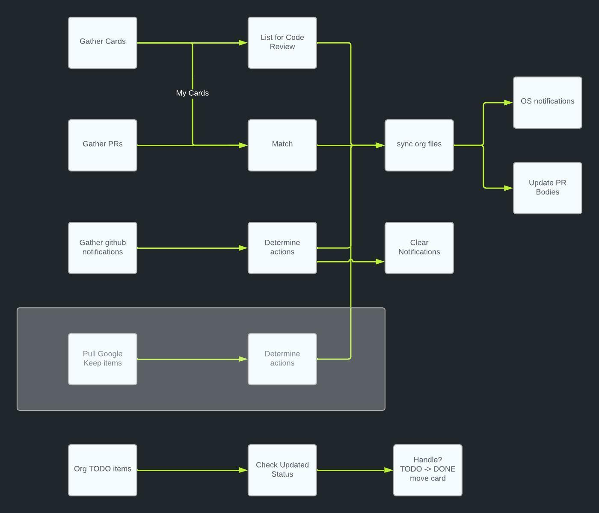

# gtdbot
Simple bot to help with my gtd workflows


# Supports a couple of workflows as shown here:



# Installation

```bash
EXPORT GTDBOT_LK_API_USERNAME = "Username"
EXPORT GTDBOT_LK_API_PASS = "Password"

make build
make run
```

see Makefile for more options
